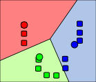
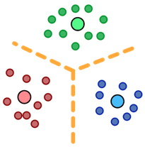
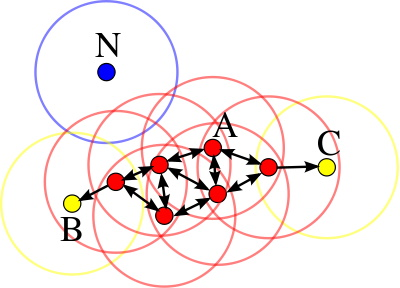
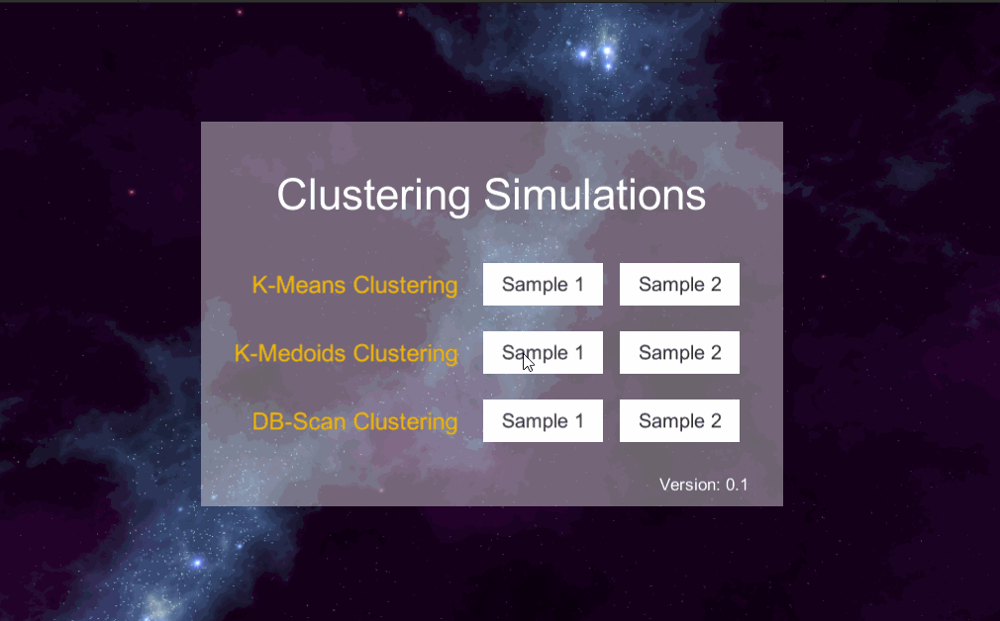

# Simple Clustering Simulations 

This project provides the implementation of three clustering algorithms in Unity3d.

` IMPORTANT: The code is not optimized for handling large number of items. Instead, it was optimized for simulation purposes by storing all the iterations and their respective data. `

| K-Means | K-Medoids | DB-Scan |
| :-----: | :-------: | :-----: |
|  |    |  |
| [wikipedia](https://en.wikipedia.org/wiki/K-means_clustering) | [wikipedia](https://en.wikipedia.org/wiki/K-medoids)   | [wikipedia](https://en.wikipedia.org/wiki/DBSCAN) |

# Demo



We created a demo that simulates and visualizes the three algorithms with two predefined samples.
A complete demo can be found on [https://omaddam.github.io/Simple-Clustering-Simulations/](https://omaddam.github.io/Simple-Clustering-Simulations/).

# Getting Started

These instructions will get you a copy of the project on your local machine for development and testing purposes.

### Prerequisites

The things you need to install before you proceed with development:

1) [Unity3d (2020.2.0f1)](https://unity3d.com/get-unity/download/archive) [required].

### Installing

A step by step guide to get you started with development.

#### Download, clone, and setup the repository

```git
git clone https://github.com/omaddam/Simple-Clustering-Simulations.git
```

#### Initialize git flow

```git
git flow init
```

# Standards

### General Standards

* Line ending: CRLF
* Case styles: Camel, Pascal, and Snake case
  * Arguments, paramters, and local variables: camel case (e.g. iterationOrder)
  * Global variables: pascal case (e.g. SeedItems)
  * Constants and static variables: snake case (ALL CAPS) (e.g. ALGORITHM_NAME)
* Methods naming convention:
  * Pascal case (e.g. GenerateSample)
  * Verbs

### Commenting Standards

* `///` Summaries: Full-usage of English grammar and punctuation. (e.g. Add periods to the end of your summaries, as if you were writing a phrase or sentence.)
*  `//` In-line comments: quick, point-form. Grammar and punctuation not needed

### Third Party Packages

* All packages should be included under Assets/ThirdParty folder.
* Contains all packages downloaded from the Unity3d store.

### Assets / App

* Contains scripts that define the flow of the application.
* Scripts are created under Assets/App/Scripts folder.

### Assets / Others

* All components should be included under Assets/\<Name> folder. (e.g. Assets/Grid)
* Each component should be isolated and under **NO CIRCUMSTANCES** referencing or using another component's scripts.
* Components are **NOT** allowed to reference or call application scripts.
* Components are allowed to reference and use ThirdParty scripts.